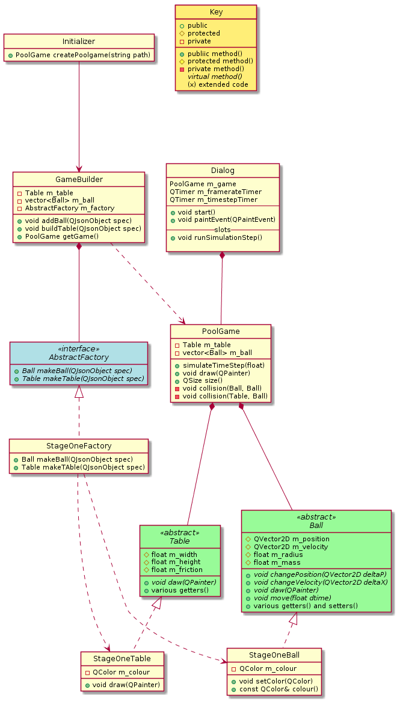

# Qt PoolTable

## Previous code structure

## Base Notes

- setters have set but getters don't have get
- abstract factory is not informative name
- Initializer has no state and one method
- Wildly inconsistent spacing around operators and variables
- memory leaks

## New code structure

## Todo

+ Move PoolGame into BaseGame
+ Implement GameFeature
+ Implement CueControl
+ Implement new ball and table
+ Implement new factory
+ Edit builder and director
+ Implement PocketInteraction
+ Implement ExplodingBall
+ Doxygen
