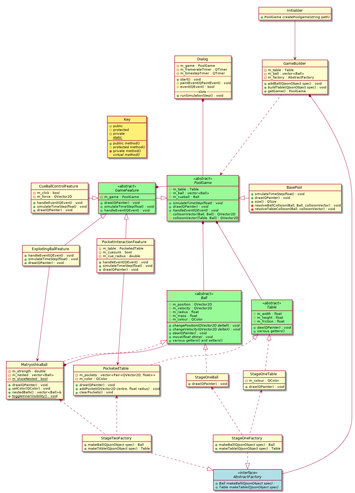

# Qt PoolTable

## Base Code

The base code was well designed with abstract classes appropriately placed where extension was most likely to happen (on the ball, table and factory classes) with single responsibility classes and simple hierarchy.
While the concrete game class would have been difficult to extend with new functionality, it was simple enough that it could easily be split into an abstract and concrete class.
There was reasonable documentation in form of doxygen comments on each class and methods.

The code followed few C++ idioms and did not utilize language features to improve readability or type safety.
Notably, containers were being enumerated by index rather than using enhanced for loop or iterators, as well as passing and using raw pointers without null checking or clean up.
Some methods which should be const like draw were not marked const, overridden methods were not marked.

It also contained inconsistent spacing between operators, which makes it difficult to read expressions.
While the naming scheme was consistent, class names such as AbstractFactory, StageOneFactory, etc. are not meaningful in any sense.  Additionally, it while it is acceptable to not put the word get and set in getters and setters, it doesn't make much sense that only setter methods uses set while getters do not use get.

The worst offender is the Initializer class which has no state and 1 member function.  This could've easily been implemented as a method on the builder itself and simplified the class hierarchy.

## Extended Code

The extended code includes a decorator design pattern on the newly created PoolGame interface
which allow GameFeature to be added to BaseGame at runtime.  This allows for individual features
to be easily tested or modified and allows any combination of switching of the features without
a polluted class hierarchy.  However, this does cost indirection when executing methods and
since some features are tied to particular concrete classes, it can cause bugs if used incorrectly.

Another design pattern found here is the composite pattern. MatryoshkaBall is a Ball that can hold
other balls (which may also hold others).  The abstract Ball class defines the draw interface
which traverses through the MatryoshkaBall structure to draw each ball if the inner visibility is toggled.
This allows for an arbitrarily large composition of balls which can be easily controlled, however,
this patterns allows for any type of ball to be composed inside a MatryoshkaBall, which could be undesirable (for example if we had a separate CueBall class which shouldn't be nested).

## New code structure

